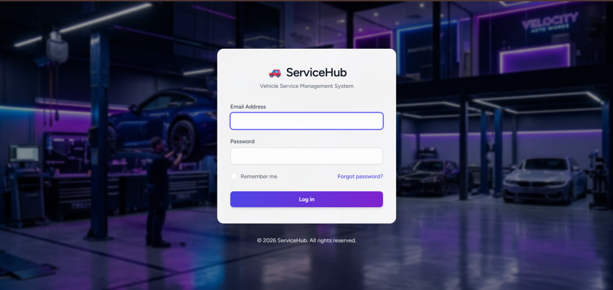
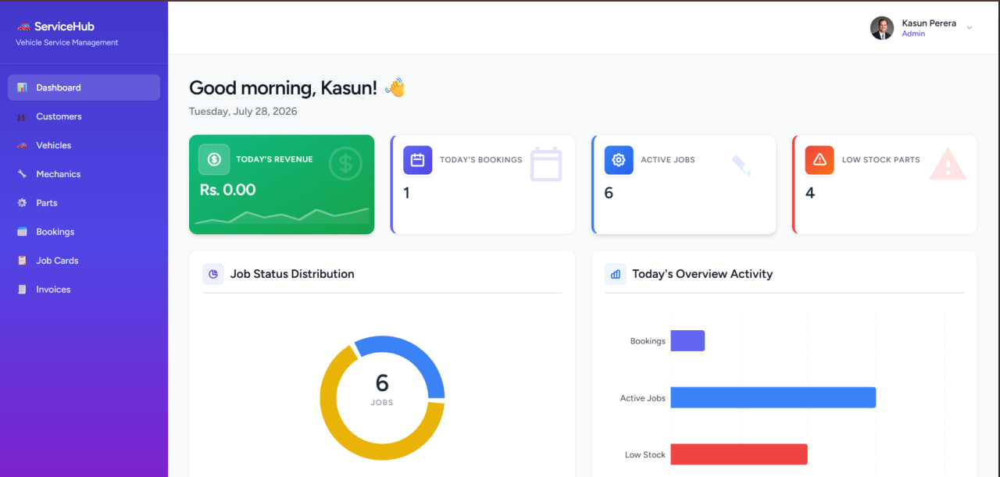
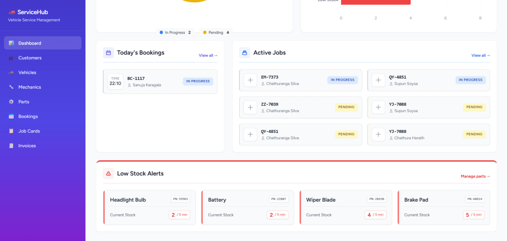
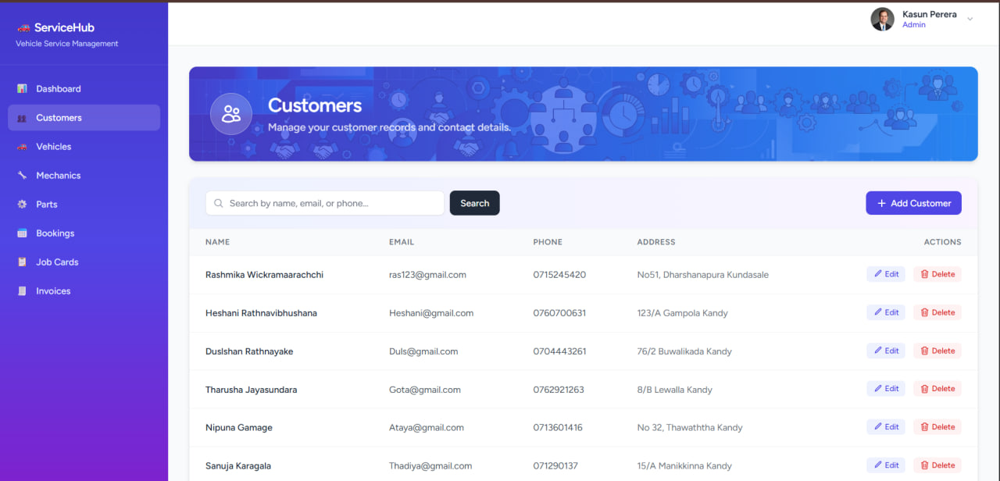
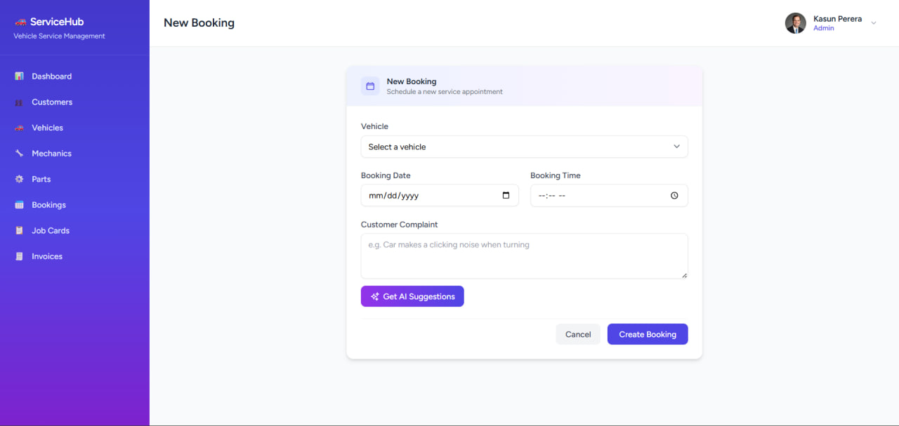
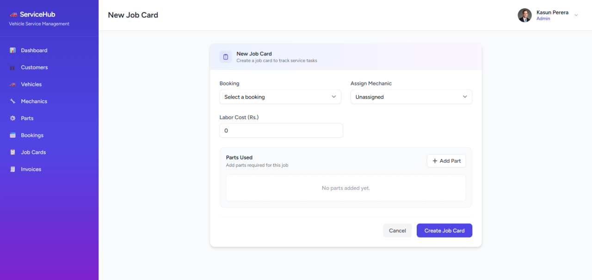
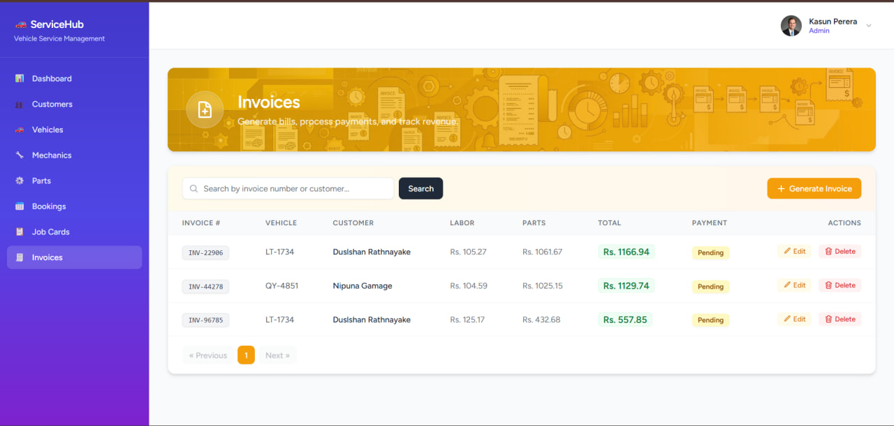

#  ServiceHub - Vehicle Service Management System

A full-stack web application for managing daily operations of a vehicle service center - customer records, vehicle tracking, service bookings, mechanic assignments, spare parts inventory, job tracking, billing, and an AI-powered service advisor.

Built as a 7-day intern project demonstrating role-based access control, Laravel best practices, and AI integration.

---

## Screenshots

### Login


### Dashboard



### Customer Management


### AI Service Advisor


### Job Cards


### Invoices & Billing


---

## Features

- **Authentication & Role-Based Access Control** - Admin, Service Advisor, and Mechanic roles with distinct permissions, powered by Spatie Laravel Permission
- **Customer Management** - Full CRUD with search and pagination
- **Vehicle Management** - Full CRUD linked to customers, with eager-loaded relationships
- **Mechanic Management** - Staff records with specialization tracking (Admin only)
- **Parts Inventory** - Stock tracking with automatic low-stock detection
- **Service Booking** - Appointment scheduling with double-booking prevention
- **Job Cards** - Mechanic and parts assignment, status workflow (Pending -> In Progress -> Completed -> Cancelled), and **automatic stock deduction** on job completion (wrapped in a database transaction)
- **Billing & Invoicing** - Auto-calculated totals (labor + parts), unique invoice number generation, payment status tracking
- **Dashboard** - Live stats: today's bookings, active jobs, low stock alerts, daily revenue, with interactive charts
- ** AI Service Advisor** - Converts natural language customer complaints into suggested issues, recommended services, and urgency level, powered by the Google Gemini API

---

## Tech Stack

| Layer | Technology |
|---|---|
| Backend | Laravel 13 |
| Frontend | Inertia.js + React |
| Styling | Tailwind CSS |
| Database | MySQL |
| Authorization | Spatie Laravel Permission |
| AI | Google Gemini API |
| Charts | Recharts |

---

## Architecture

The project follows Laravel best practices with clear separation of concerns:

- **Form Requests** handle all input validation
- **Service Classes** contain business logic (kept out of controllers)
- **Policies** enforce role-based authorization at the model level
- **Database Transactions** protect critical operations (stock deduction, invoice generation)
- **Eager Loading** used throughout to prevent N+1 query issues

---

## Setup Instructions

### Prerequisites

- PHP 8.2+
- Composer
- Node.js 18+ & npm
- MySQL 8.0+
- Git

### Installation

1. **Clone the repository**
```bash
git clone https://github.com/wickramaarachchi-er/vehicle-service-management-system.git
cd vehicle-service-management-system
```

2. **Install PHP dependencies**
```bash
composer install
```

3. **Install JavaScript dependencies**
```bash
npm install --legacy-peer-deps
```

4. **Set up environment file**
```bash
cp .env.example .env
php artisan key:generate
```

5. **Configure your database** in `.env`:
DB_CONNECTION=mysql
DB_HOST=127.0.0.1
DB_PORT=3306
DB_DATABASE=vehicle_service_system
DB_USERNAME=root
DB_PASSWORD=your_password

6. **Add your Gemini API key** in `.env` (required for the AI Service Advisor feature):
GEMINI_API_KEY=your_gemini_api_key_here


7. **Create the database**
```sql
CREATE DATABASE vehicle_service_system;
```

8. **Run migrations and seed sample data**
```bash
php artisan migrate:fresh --seed
```

9. **Create the storage symlink** (needed for profile avatar uploads)
```bash
php artisan storage:link
```

10. **Build frontend assets and start the servers**

Terminal 1:
```bash
npm run dev
```

Terminal 2:
```bash
php artisan serve
```

11. Visit **http://127.0.0.1:8000**

---

## Test Credentials

| Role | Email | Password |
|---|---|---|
| Admin | admin@vehicleservice.com | admin123 |
| Service Advisor | advisor@vehicleservice.com | advisor123 |
| Mechanic | mechanic@vehicleservice.com | mechanic123 |

---

## Role Permissions

| Module | Admin | Service Advisor | Mechanic |
|---|---|---|---|
| Dashboard | Have | Have | Have |
| Customers | Full CRUD | Create/Edit | No |
| Vehicles | Full CRUD | Create/Edit | No |
| Mechanics | Full CRUD | View only | No |
| Parts | Full CRUD | Create/Edit/View | View only |
| Bookings | Full CRUD | Create/Edit | No |
| Job Cards | Full CRUD (any) | Create/Edit (any) | Edit own assigned only |
| Invoices | Full CRUD | Create/Edit | No |

---

## Database Schema

Core entities and relationships:

- **Customer** -> has many **Vehicles**
- **Vehicle** -> belongs to Customer, has many **Bookings**
- **Booking** -> belongs to Vehicle & Customer, has one **Job Card**
- **Job Card** -> belongs to Booking, belongs to **Mechanic**, has many **Parts** (via pivot), has one **Invoice**
- **Part** -> tracks stock quantity and low-stock threshold
- **Invoice** -> belongs to Job Card, auto-calculates labor + parts totals

---

## AI Feature: Service Advisor

Located on the Booking creation page. A Service Advisor types a customer's complaint in natural language (e.g., *"My car makes a clicking noise when turning"*), clicks **"Get AI Suggestions"**, and the system returns:
- Possible issues
- Recommended services
- Urgency level (Low / Medium / High)

Powered by the Google Gemini API (`gemini-flash-latest` model), with graceful fallback handling if the API is unavailable.

---

##  Project Structure
## Project Structure

```
app/
├── Http/
│   ├── Controllers/       # Thin controllers, delegate to Services
│   ├── Requests/          # Form Request validation classes
│   └── Middleware/        # CheckRole, HandleInertiaRequests
├── Models/                # Eloquent models with relationships
├── Policies/               # Authorization logic per model
├── Services/                # Business logic layer
database/
├── migrations/              # Schema definitions
├── seeders/                  # Sample data generation
├── factories/                # Model factories for realistic data
resources/js/
├── Layouts/                  # AuthenticatedLayout (sidebar shell)
├── Pages/                     # Inertia page components per module
routes/
└── web.php                     # All application routes
```

---
---

##  Notes

- All database-critical operations (stock deduction, invoice generation) are wrapped in `DB::transaction()` for data integrity
- Double-booking prevention is enforced at the validation layer using a scoped `Rule::unique` check
- Low stock detection uses `whereColumn('stock_quantity', '<=', 'low_stock_threshold')` and powers both the Dashboard and Parts module

---

## Demo Video

[Link to be added]

---

## Author

Erand Wickramaarachchi - 7-Day Intern Assignment